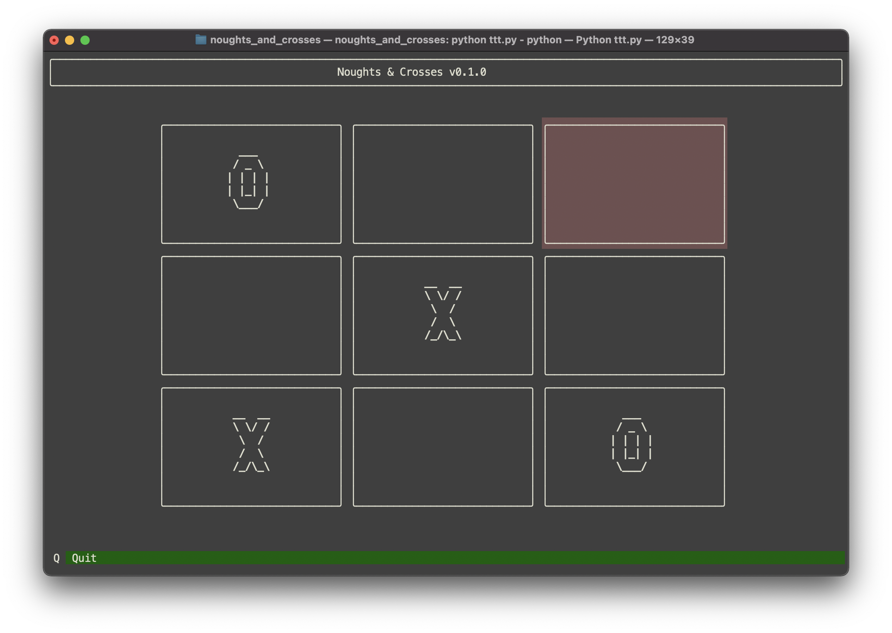

# Noughts & Crosses

[](https://github.com/vyalovvldmr/noughts_and_crosses/actions/workflows/run_tests.yml)

Client-server Noughts & Crosses (Tic Tac Toe) terminal based game through websockets.

### Requires

Python 3.10

### Installation

```
$ git clone git@github.com:vyalow/noughts_and_crosses.git
$ cd noughts_and_crosses
$ pip install -r requirements.txt
```

### Run client

`python ttt.py`



### Run server

`python server.py`

### Run tests

```
$ pytest --cov
=========================== test session starts ================================
platform darwin -- Python 3.10.5, pytest-7.1.2, pluggy-1.0.0
rootdir: noughts_and_crosses
plugins: cov-3.0.0
collected 13 items                    

tests/test_game.py ....         [ 30%]
tests/test_validation.py .....  [ 69%]
tests/test_ws_server.py ....    [100%]

---------- coverage: platform darwin, python 3.10.5-final-0 ----------
Name                                Stmts   Miss  Cover
-------------------------------------------------------
noughts_and_crosses/__init__.py         0      0   100%
noughts_and_crosses/app.py              7      0   100%
noughts_and_crosses/errors.py           2      0   100%
noughts_and_crosses/game.py            54      0   100%
noughts_and_crosses/game_pool.py       25      1    96%
noughts_and_crosses/ws_handler.py      41      1    98%
noughts_and_crosses/ws_utils.py        13      0   100%
-------------------------------------------------------
TOTAL                                 142      2    99%


============================ 13 passed in 0.29s ================================
```

### TODO

- [x] Bump up Python version from 3.5 to 3.10
- [x] Fix tests stability after bumping aiohttp from 1.3 to 3.8
- [x] Set up code linting
- [x] Set up mypy
- [ ] DDD & clean code refactoring
- [ ] Better client
- [ ] Add to PyPI
- [ ] Heroku deployment
- [ ] Migrate from aiohttp to starlette or migrate from websockets to gRPC
- [ ] Expand play board
- [ ] Add gameplay with a computer
