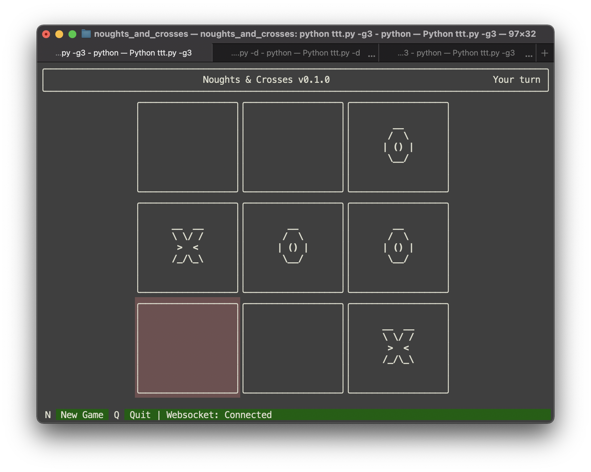
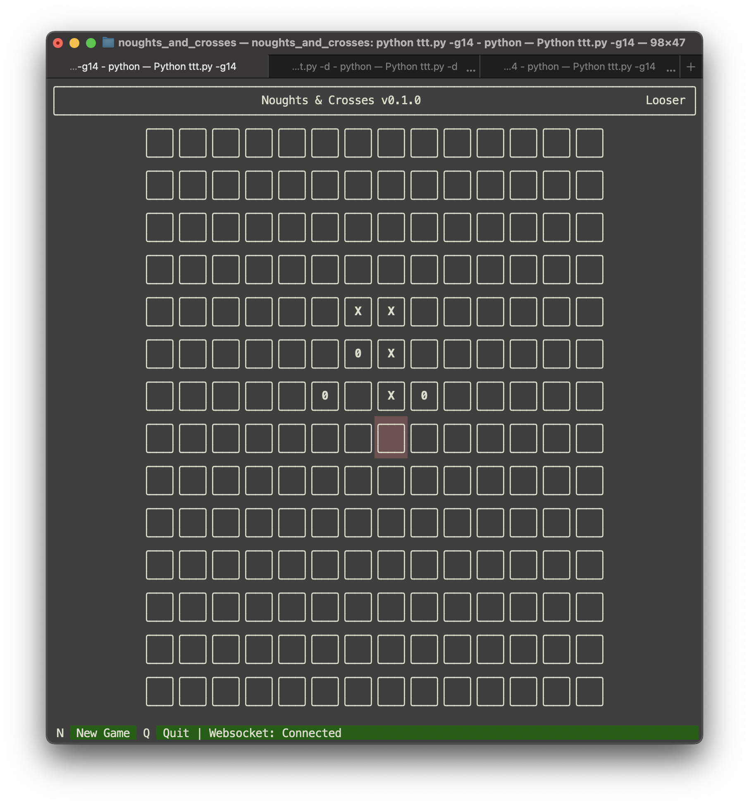

# Noughts & Crosses

[](https://github.com/vyalovvldmr/ttt/actions/workflows/run_tests.yml)

Client-server Noughts & Crosses (Tic Tac Toe) terminal based, multiplayer game through websockets.

### Requires

Python 3.10

### Install

```
$ git clone git@github.com:vyalow/ttt.git
$ cd ttt
$ pip install -r requirements.txt
```

### Run game

```
$ python ttt.py
```



Command line option `-g` or `--grid-size` changes grid size.
Option `-w` or `--wining-length` changes winning sequence length.
Option `-h` or `--help` prints help.

```
$ python ttt.py -g14 -w3
```



### Run server

```
$ python ttt.py -d
```

### Run tests

```
$ pip install -r requirements-dev.txt
$ pytest --cov
```

### TODO

- [x] Bump up Python version from 3.5 to 3.10
- [x] Fix tests stability after bumping aiohttp from 1.3 to 3.8
- [x] Set up code linting
- [x] Set up mypy
- [ ] Fix aiohttp deprecations
- [x] Better client
- [ ] Add to PyPI
- [ ] Heroku deployment
- [ ] Migrate from aiohttp to starlette or migrate from websockets to gRPC
- [x] Expand play board
- [ ] Add gameplay with a computer
